# Mini Account Management System

Mini Account Management System is a simple yet powerful web-based platform designed to help businesses manage their financial records efficiently. Developed using ASP.NET Core Razor Pages and SQL Server with stored procedures (no LINQ or Entity Framework), this system supports role-based access, organized account structures, voucher management, and essential financial reporting.

---

## Overview

The Mini Account Management System is built to simplify financial recordkeeping for businesses by offering secure, role-based access to key accounting features. Users can manage a structured chart of accounts, enter and track vouchers, and generate basic financial reports. The system supports three distinct user roles (Admin, Accountant, and Viewer) each with specific access permissions tailored to their responsibilities.

---

## Technologies Used

- **ASP.NET Core 8 (Razor Pages)**
- **MS SQL Server** (Stored Procedures only)
- **ASP.NET Identity** (Authentication + Role Management)
- **Bootstrap 5**
- **jQuery + Datatbles**

---

## User Roles and Permissions

Each user role has specific access to system modules based on their responsibilities:

| Role       | Admin Panel | Chart of Accounts | Vouchers | Reports |
|------------|-------------|-------------------|----------|---------|
| Admin      | Yes         | Yes               | Yes      | Yes     |
| Accountant | No          | Yes               | Yes      | Yes     |
| Viewer     | No          | No                | No       | Yes     |


- Authorization enforced using `[Authorize(Roles = "...")]` attributes
- Sidebar UI dynamically adjusts based on role

---

## Authentication

- Built with ASP.NET Core Identity for handling user authentication and authorization.
- Roles (Admin, Accountant, Viewer) are manually assigned by the Admin.
- Access to each module is restricted based on the user's assigned role.
- User sessions are managed securely using token and cookie-based authentication mechanisms provided by ASP.NET Identity.


---
## Core Modules

### 1. User and Role Management
- Admin creates and manages users
- Role assignment (Admin, Accountant, Viewer)
- Module visibility and access are tied to roles

### 2. Chart of Accounts (COA)
- Create/Update/Delete accounts like Cash, Bank, Receivable
- Display account tree with parent-child structure

### 3. Voucher Types
This module is used to define different types of vouchers that categorize financial transactions—such as Journal, Payment, and Receipt vouchers. Admins and Accountants can manage these types as needed.

### 4. Voucher Entry
This feature allows users to create financial vouchers. Each voucher supports:
- Selection of a voucher type (e.g., Journal, Payment, Receipt)
- Entry of multiple debit and credit lines
- Automatic total calculation for both debit and credit
- Account selection through searchable dropdowns

### 5. Reports
Users with reporting access can view summaries of financial data, including:
- Trial Balance
- Voucher Summary

An optional feature allows exporting reports to Excel for external use or auditing.

---

## UI Features

- The application includes a sidebar menu with clear navigation and collapsible sections for organized access to each module.
- A fixed logout option is always available at the bottom of the sidebar for convenience.
- The layout is fully responsive and adapts to different screen sizes using Bootstrap 5.
- A custom logo is displayed next to the application title to maintain branding throughout the interface.
- The currently active menu item is automatically highlighted to help users keep track of their location within the system.


---

## Database Structure

- All data operations use **stored procedures** only
- No Entity Framework or LINQ used
- DB connection string managed via `appsettings.json`

---

## Testing Scenarios

- **Admin Login** → Full access
- **Accountant Login** → All except Admin panel
- **Viewer Login** → Only access Reports menu

---

## 🔄 Folder Structure
MiniAccountApp/
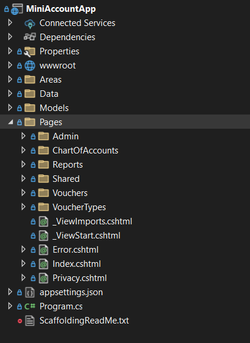


---

## Setup Instructions

Follow these steps to set up and run the **Mini Account Management System** on your local machine.

### Prerequisites

Make sure you have the following software installed:

- **SQL Server** (or SQL Server Express)
- **.NET 8 SDK** (or later)
- **SQL Server Management Studio (SSMS)** (2022)

---

### 1. Clone the Repository

Start by cloning the repository to your local machine:

```bash
git clone https://github.com/yourusername/MiniAccountApp.git
```
Navigate to the project directory:
```bash
cd MiniAccountApp
```
### 2. Restore the Database
The database is provided as a backup file (`MiniAccountDB.bak`). Follow the steps below to restore it.

#### Using SQL Server Management Studio (SSMS)

- Open **SQL Server Management Studio** and connect to your SQL Server instance.
- Right-click on **Databases** in the Object Explorer and select **Restore Database**.
- In the **Restore Database** window:
  - Select **Device** and click the ellipsis (`...`) to browse for the `.bak` file.
  - Browse to the location of the `MiniAccountDB.bak` file and select it.
  - Click **OK** to begin the restoration process.

### 3. Login with Test Accounts and Roles

To log in and test the application, use the following test accounts with their respective roles:

#### Test Accounts:

- **Admin**:
  - Username: `admin@test.com`
  - Password: `Admin@123`

- **Accountant**:
  - Username: `f@gmail.com`
  - Password: `Aa@123456`

- **Viewer**:
  - Username: `labib@gmail.com`
  - Password: `Labib@123`

#### Accessing the Application:

- After running the application with the `dotnet run` command, open a web browser and navigate to `http://localhost:5000` (or the specified port).
- Log in using one of the above test accounts.
- Based on your assigned role, you will have access to different parts of the application.


---

## Bonus Features

- Export reports to Excel
- Voucher total auto-calculation
- AJAX-based form validation (future enhancement)

---

## 📸 Screenshots

> Include screenshots of:
> - Dashboard
> - Sidebar (Admin / Accountant / Viewer)
> - Voucher Form
> - Report View

### Screenshots

1. **Dashboard**  
   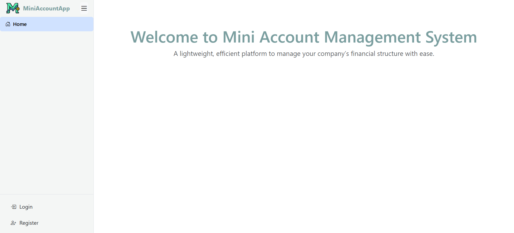

2. **Sidebar (Admin)**  
   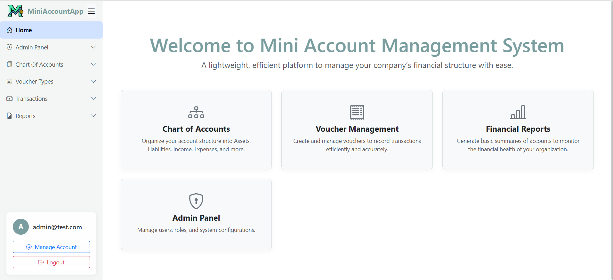

3. **Create Users**  
   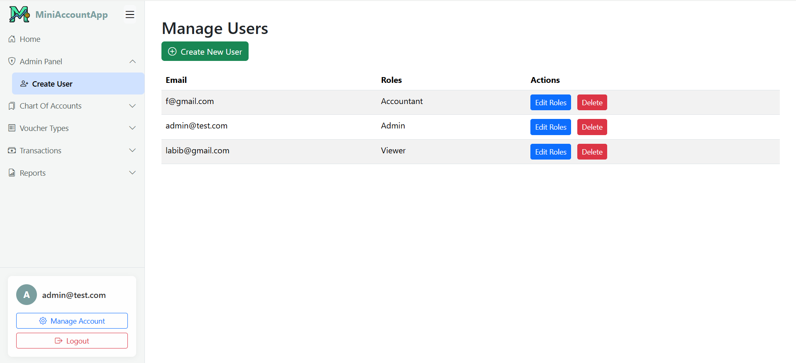

4. **Create Chart of Accounts**  
   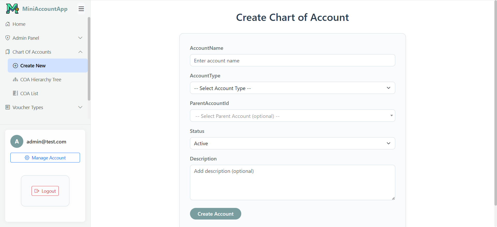

5. **Chart of Accounts Tree**  
   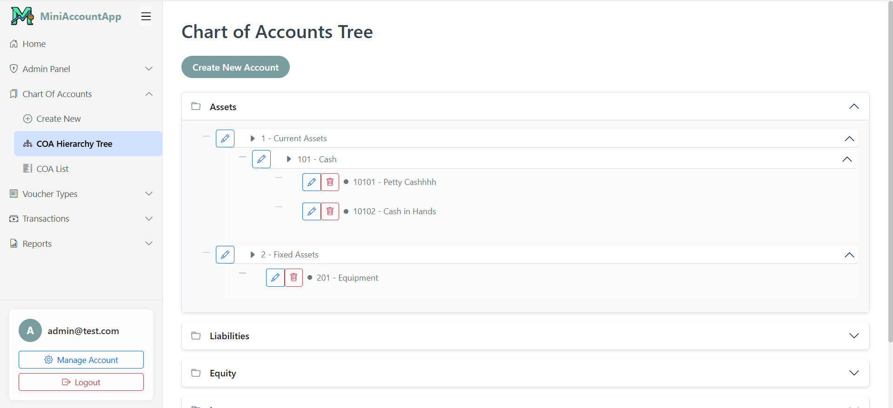

6. **Chart of Accounts List**  
   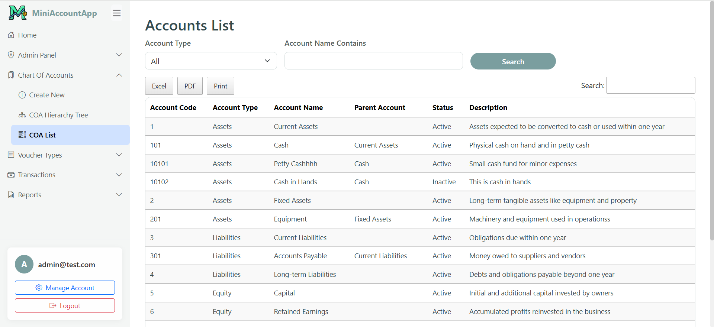

7. **Create Voucher Type**  
   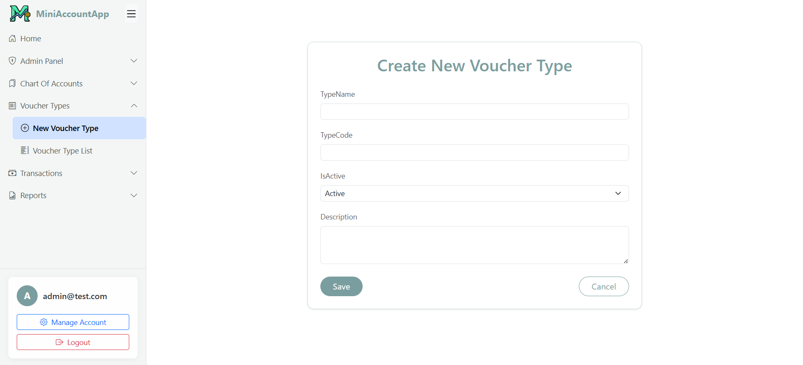

8. **Voucher Type List**  
   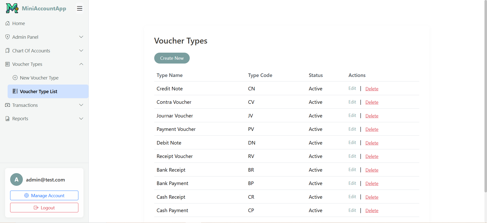

9. **Voucher Entry**  
   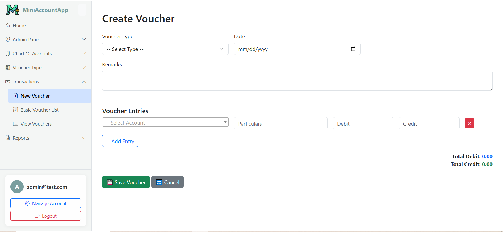

10. **Basic Voucher List**  
   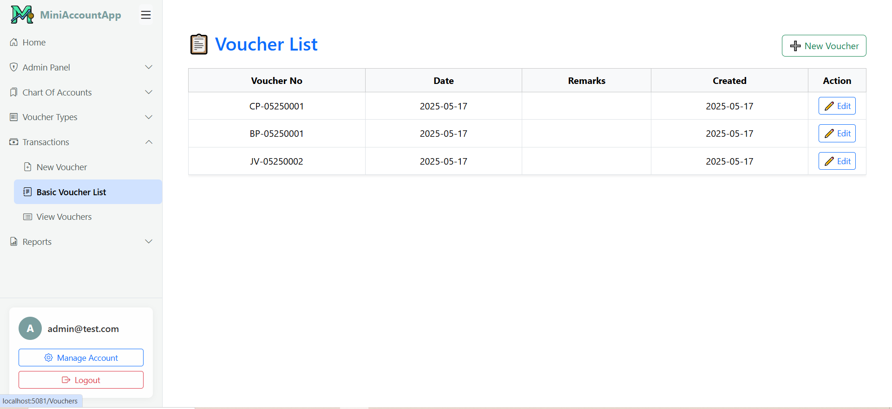

11. **Voucher View with export buttons**  
   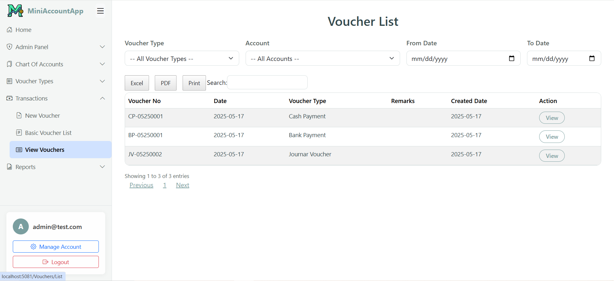

12. **Trial Balance Report**  
   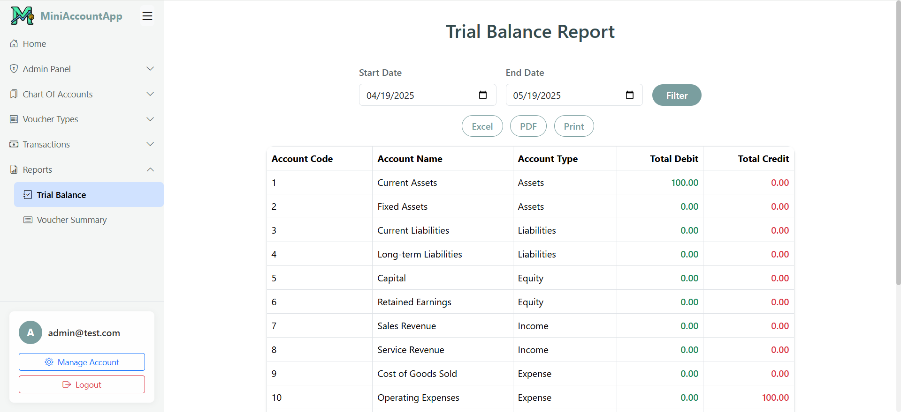

13. **Voucher Summary Report**
   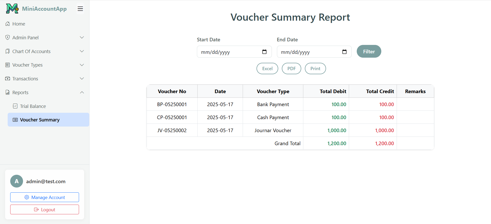

---


